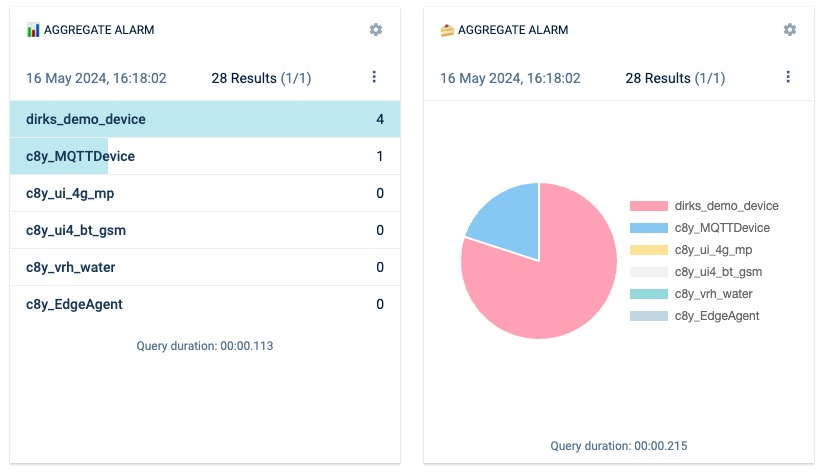
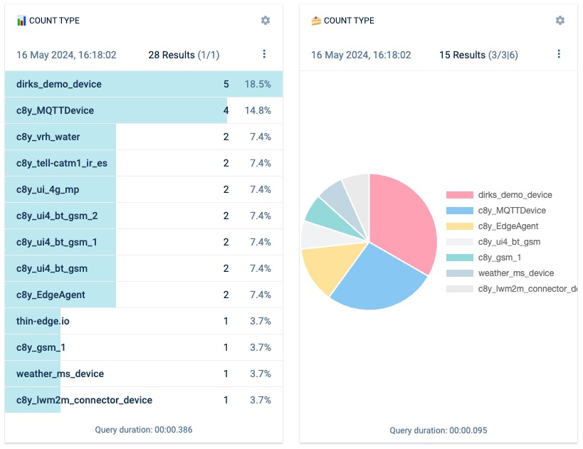
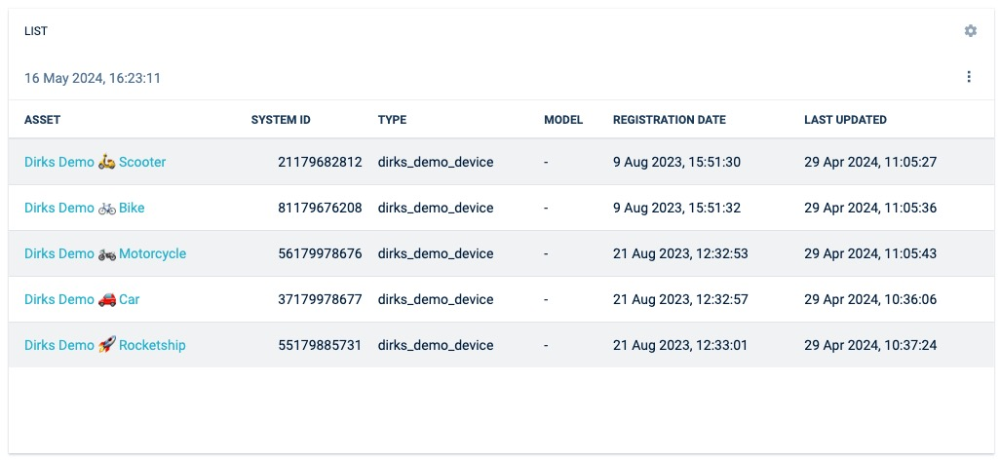
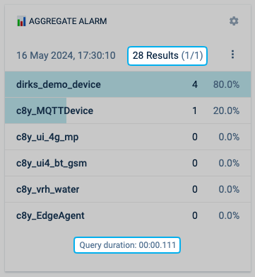
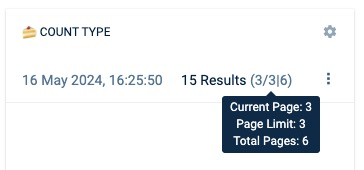
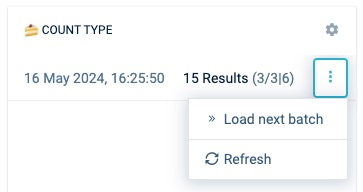
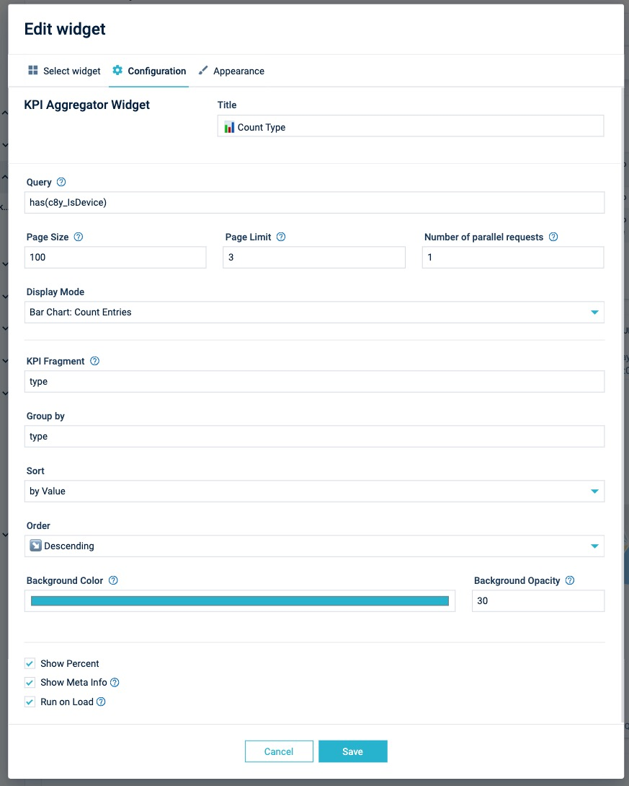

# Cumulocity IoT UI KPI Aggregator Widget Plugin

## Features

### Display Modes

Currently, five display modes are available. Functional, both aggregation and counting views share identical configurations and provide two visualisation flavours: 📊 bar and 🍰 pie chart.

  
<small>Display aggregated values: bar chart (left) and pie chart (right).</small>

  
<small>Display counted values: bar chart with percent values (left) and pie chart (right).</small>

  
<small>Display mode: table</small>

### Meta Information

  
<small>Highlighted request meta information: Paging (top) and duration of query (bottom).</small>

  
<small>Paging detail information in tooltip</small>

### Additional Actions

  
<small>The drop down menu provides access to actions, such as refreshing the data.</small>

### Widget Config



#### Useful config samples

- Count all devices by type
  - Query: `has(c8y_IsDevice)`
  - Display Mode: `Bar Chart: Count Entries`
  - KPI Fragment: `type`
  - Group by: `type`
  - Sort: `by Value`
  - Order: `Descending`
  - `Show Meta Info` and `Run on Load` checked
- Aggregate critical alarms by device type
  - Query: `has(c8y_IsDevice)`
  - Display Mode: `Pie Chart: Aggregate Entries`
  - KPI Fragment: `c8y_ActiveAlarmsStatus.major`
  - Group by: `type`
  - Label: `type`
  - Sort: `by Value`
  - Order: `Descending`
  - `Show Percent` and `Run on Load` checked

---

## Installation and update

---

## Local Development

### Recommended version

- node v 14.x
- npm v 6.x

### Plugin versions

- Angular v 14.x
- WebSDK v 1017.0.x

### How to start

Change the target tenant and application you want to run this plugin on in the `package.json`.

```bash
c8ycli server -u https://{{your-tenant}}.cumulocity.com/ --shell {{cockpit}}
```

Keep in mind that this plugin needs to have an app (e.g. cockpit) running with at least the same version as this plugin. if your tenant contains an older version, use the c8ycli to create a cockpit clone running with **at least version 1016.0.59**! Upload this clone to the target tenant (e.g. cockpit-1016) and reference this name in the `--shell` command.

The widget plugin can be locally tested via the start script:

```bash
npm start
```

In the Module Federation terminology, `widget` plugin is called `remote` and the `cockpit` is called `shell`. Modules provided by this `widget` will be loaded by the `cockpit` application at the runtime. This plugin provides a basic custom widget that can be accessed through the `Add widget` menu.

> Note that the `--shell` flag creates a proxy to the cockpit application and provides `KpiAggregatorWidgetPluginModule` as an `remote` via URL options.

Also deploying needs no special handling and can be simply done via `npm run deploy`. As soon as the application has exports it will be uploaded as a plugin.

---

## Useful links

### 📘 Explore the Knowledge Base

Dive into a wealth of Cumulocity IoT tutorials and articles in the [TECHcommunity Knowledge Base](https://tech.forums.softwareag.com/tags/c/knowledge-base/6/cumulocity-iot).

### 💡 Get Expert Answers

Stuck or just curious? Ask the Cumulocity IoT experts directly on our [Software AG TECHcommunity Forums](https://tech.forums.softwareag.com/tags/c/forum/1/Cumulocity-IoT).

### 🚀 Try Cumulocity IoT

See Cumulocity IoT in action with a [Free Trial](https://techcommunity.softwareag.com/en_en/downloads.html).

### ✍️ Share Your Feedback

Your input drives our innovation. If you find a bug, please create an [issue](./issues) in the repository. If you’d like to share your ideas or feedback, please post them in our [Tech Forums](https://tech.forums.softwareag.com/c/feedback/2).

### More to discover

- [Cumulocity IoT Web Development Tutorial - Part 1: Start your journey](https://tech.forums.softwareag.com/t/cumulocity-iot-web-development-tutorial-part-1-start-your-journey/259613)
- [How to install a Microfrontend Plugin on a tenant and use it in an app?](https://tech.forums.softwareag.com/t/how-to-install-a-microfrontend-plugin-on-a-tenant-and-use-it-in-an-app/268981)
- [The power of micro frontends – How to dynamically extend Cumulocity IoT Frontends](https://tech.forums.softwareag.com/t/the-power-of-micro-frontends-how-to-dynamically-extend-cumulocity-iot-frontends/266665)

---

This widget is provided as-is and without warranty or support. They do not constitute part of the Software AG product suite. Users are free to use, fork and modify them, subject to the license agreement. While Software AG welcomes contributions, we cannot guarantee to include every contribution in the master project.

<!-- <:3  )~~ -->
